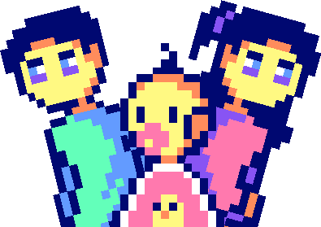
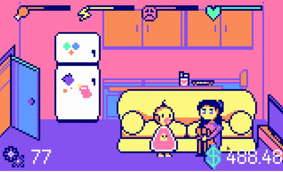

  
  
  <h1>Maybe parents need babysitting, too.</h2>
  
  ## | [**Play the game.**](https://mahyellaw.itch.io/baby-sitter) |

## Project Summary. 📝

"Baby Sitter" is my 48-hour jam entry for this year's GMTK Game Jam with the theme: _**Roles Reversed.**_  
Our take on the theme is simply a game about a baby taking care of its parent, rather than the other way around.  
The concept was mainly brainstormed by me and the boiz, especially my big brain boi [@Mizu](https://www.youtube.com/@mizuki.69).

## Software and Technologies. 🔨

- [Godot Engine](https://godotengine.org)
- [Aseprite](https://www.aseprite.org)
- [SFXR](http://drpetter.se/project_sfxr.html)

## Feedback. 💌

Open to receive feedback and criticism as always. Feel free to let me know your thoughts on the game, cheers! 🧡

<ul>
  
  <a href="https://discord.com">mahyellaw</a>
   
  
  <a href="https://twitter.com/mahyellaw">@mahyellaw</a>
   
  
  <a href="https://facebook.com/mahyellawStudios">@mahyellawStudios</a>
</ul>
